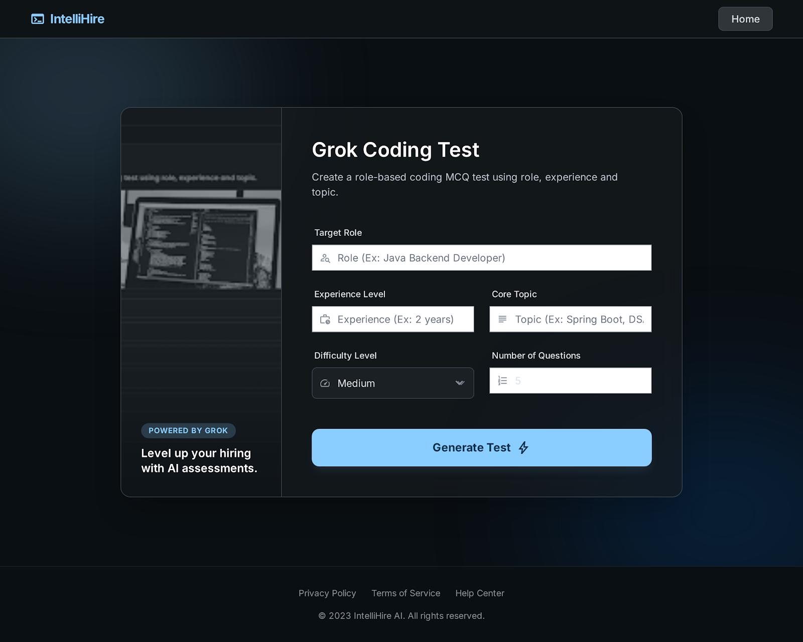
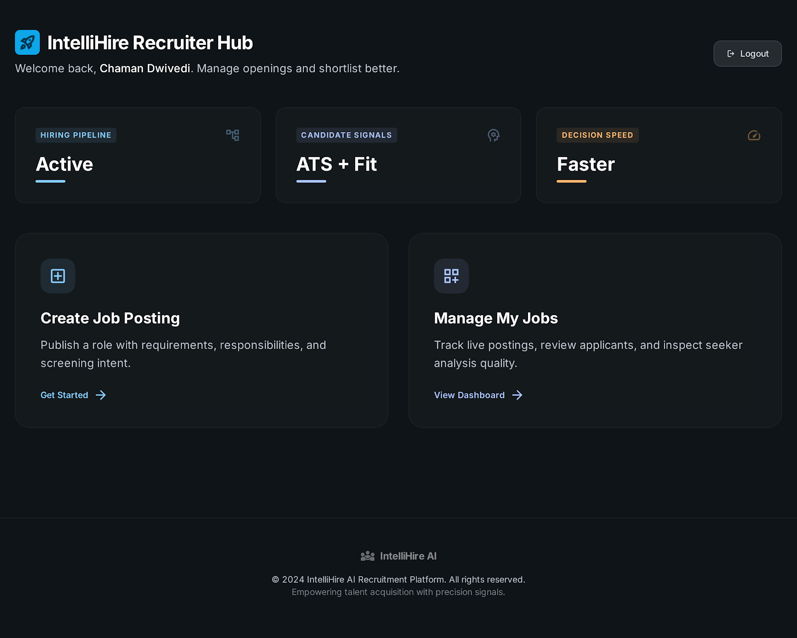
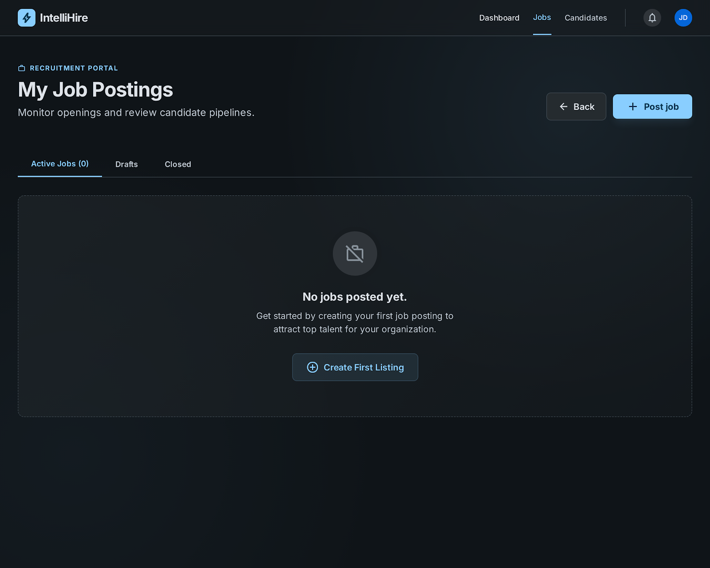
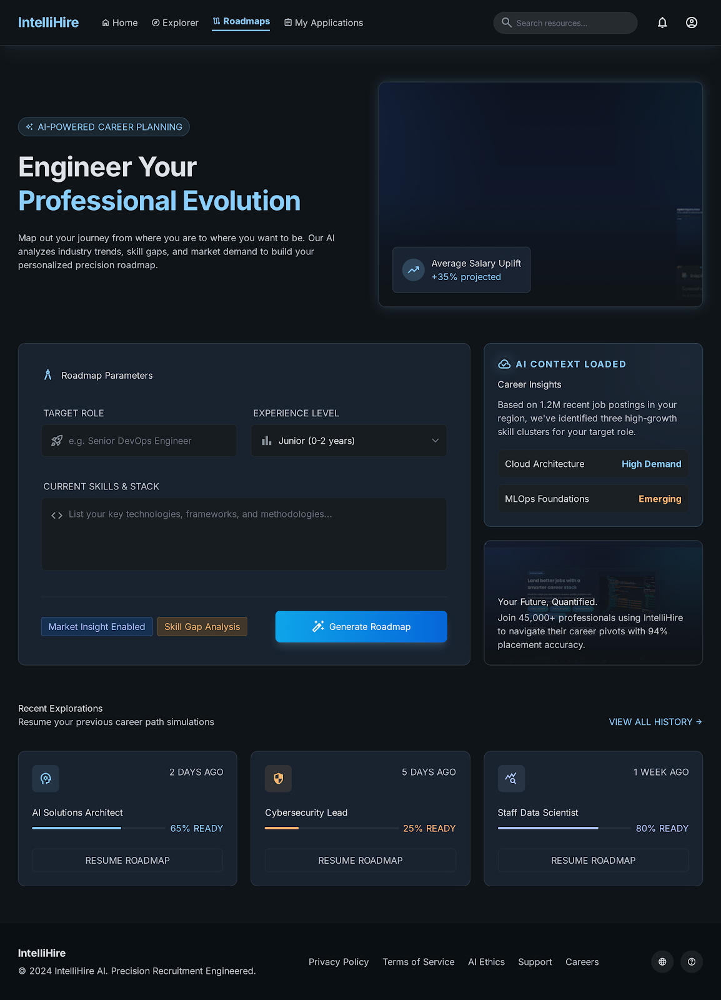

# IntelliHire — AI Resume Analyzer & Recruitment Suite


[](https://render.com)
[](https://react.dev)
[](https://spring.io/projects/spring-boot)
[](https://www.mysql.com)

---

## Overview

**IntelliHire** is a polished recruitment and resume analysis platform built with **React + Vite** for the frontend and **Spring Boot** for the backend. It combines AI-powered resume evaluation, career roadmap generation, coding test creation, and job matching into a single high-end experience.

This README is designed to showcase the app as if it were built by a premium developer — clean structure, professional UX screenshots, deployment-ready configuration, and easy setup.

---

## Why IntelliHire

- ✅ **AI Resume Assessment** using strict ATS scoring and resume quality analysis
- ✅ **Google OAuth login** with secure backend authentication
- ✅ **Job recommendations** pulled from Adzuna based on resume role analysis
- ✅ **Full-stack Docker deployment** ready for Render
- ✅ **Modern dark UI** with polished onboarding and dashboard flow

---

## What makes this project strong

- **Modular architecture**: `frontend/` and backend live in the same repo with a clean Docker pipeline
- **Environment-driven secrets**: `API_KEY`, `GEN_AI_KEY`, `GOOGLE_CLIENT_ID`, and `GOOGLE_CLIENT_SECRET`
- **CORS-friendly deployment**: backend accepts secure frontend origins via `CORS_ALLOWED_ORIGINS`
- **Static frontend build** is copied into Spring Boot static resources automatically via Docker

---

## Screenshots

### Home / Dashboard



### Career Roadmap Flow



### Applications / Recruiter Workflow



---

## Architecture

### Frontend
- `frontend/src/` contains React components, routes, styles, and context.
- `frontend/src/appcontext.jsx` dynamically resolves backend API origin.
- Built with **Vite** and copied into `src/main/resources/static` for backend hosting.

### Backend
- `src/main/java/com/ai/Resume/analyser/` contains Spring Boot controllers and services.
- Uses **Spring Security**, **JWT**, **Google OAuth**, **Tika** resume parsing, and `RestTemplate` for external AI/Adzuna calls.
- `Dockerfile` builds the frontend first, then packages the Spring Boot app into a single deployable JAR.

---

## Local Setup

### 1) Frontend
```bash
cd frontend
npm install
npm run build
```

### 2) Backend
```bash
cd ..
./mvnw clean package -DskipTests
```

### 3) Run with Docker
```bash
docker build -t intellihire-backend .
docker run -p 8080:8080 intellihire-backend
```

Then open:

- Frontend served from backend: `http://localhost:8080`

---

## Environment Variables

The backend is designed to read from environment variables and supports fallback values for a clean deploy.

| Variable | Purpose |
|---|---|
| `API_KEY` | Fallback key for AI or mail if `GEN_AI_KEY` or `MAIL_API_KEY` are missing |
| `GEN_AI_KEY` | AI generator key used for Groq / x.ai completion calls |
| `MAIL_API_KEY` | Sendinblue / mail API key |
| `DB_USERNAME` | Database username |
| `DB_PASSWORD` | Database password |
| `GOOGLE_CLIENT_ID` | Google OAuth client ID |
| `GOOGLE_CLIENT_SECRET` | Google OAuth client secret |
| `ADZUNA_APP_ID` | Adzuna app ID for job search |
| `ADZUNA_APP_KEY` | Adzuna API key for job search |
| `CORS_ALLOWED_ORIGINS` | Allowed frontend origin(s) in Render / production |
| `PORT` | Runtime port for Render or Docker |

---

## Render Deployment

Use **Render** with the existing `Dockerfile` at the repo root.

### Render settings
- Root directory: `.`
- Dockerfile path: `Dockerfile`
- Environment: `Docker`
- Branch: `main`
- Auto Deploy: enabled

### Required Render env vars
```text
API_KEY
GEN_AI_KEY
MAIL_API_KEY
DB_USERNAME
DB_PASSWORD
GOOGLE_CLIENT_ID
GOOGLE_CLIENT_SECRET
ADZUNA_APP_ID
ADZUNA_APP_KEY
CORS_ALLOWED_ORIGINS=https://your-frontend-url
```

### Google OAuth redirect URI
```text
https://<your-backend-url>/login/oauth2/code/google
```

---

## How resume analysis works

1. User uploads resume on frontend
2. Backend extracts text using **Apache Tika**
3. Resume content is sent to the AI service using `GEN_AI_KEY`
4. Response is parsed into strict JSON score data
5. The frontend displays scores, pros, cons, suggestions, and job matches

> Important: if you only set `MAIL_API_KEY` or `API_KEY`, the resume analysis will still require `GEN_AI_KEY` unless you rely on the fallback.



